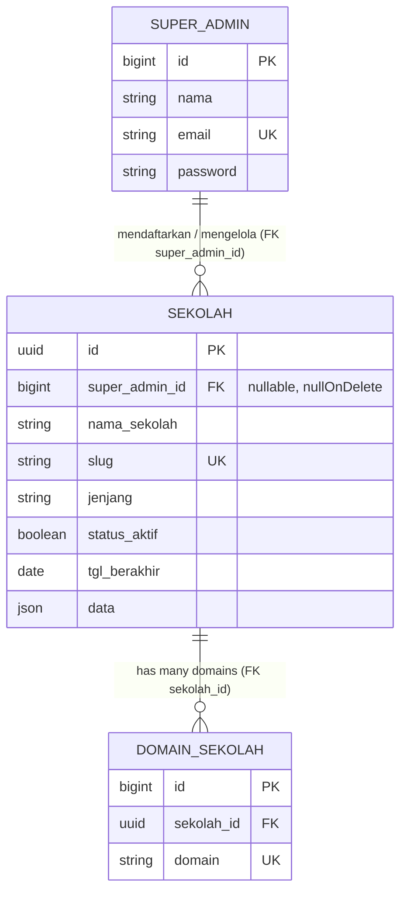

# Database Schema, ERD & Data Dictionary — Website Sekolah

Sistem menggunakan arsitektur **Multi-Database Multi-Tenant**:
1. **Central Database (`website_sekolah_central`)**: Registri sekolah/tenant, domain, dan Super Admin.
2. **Tenant Database (`tenant_{slug}`)**: Data operasional spesifik masing-masing sekolah di mana **SELURUH TABEL (100%) TELAH DIBUATKAN RELASI FOREIGN KEY (FK) DAN TERHUBUNG DALAM ERD**.

---

## 1. Entity Relationship Diagram (ERD)

### A. Central Database ERD

### B. Tenant Database ERD (Semua Tabel Terhubung)

```mermaid
erDiagram
    %% Authorship, Operations & System Logs
    PENGGUNA ||--o{ ARTIKEL : "menulis artikel (FK pengguna_id)"
    PENGGUNA ||--o{ AGENDA : "menerbitkan agenda (FK pengguna_id)"
    PENGGUNA ||--o{ UNDUHAN : "mengunggah berkas (FK pengguna_id)"
    PENGGUNA ||--o{ SLIDER_BERANDA : "mengatur slide (FK pengguna_id)"
    PENGGUNA ||--o{ HALAMAN_STATIS : "mengedit halaman (FK pengguna_id)"
    PENGGUNA ||--o{ KALENDER_AKADEMIK : "menyusun jadwal (FK pengguna_id)"
    PENGGUNA ||--o{ PESAN_MASUK : "petugas respons (FK petugas_id)"
    PENGGUNA ||--o{ PENGATURAN_PPDB : "admin panitia (FK pengguna_id)"
    PENGGUNA ||--o{ PENGATURAN_UMUM : "mengubah profil (FK pengguna_id)"
    PENGGUNA ||--o{ PENGATURAN_FITUR : "mengatur sakelar (FK pengguna_id)"
    PENGGUNA ||--o{ SOSIAL_MEDIA : "mengelola tautan medsos (FK pengguna_id)"
    PENGGUNA ||--o{ MEDIA : "mengunggah / mengelola berkas (FK pengguna_id)"
    
    %% Article Categorization
    KATEGORI_ARTIKEL ||--o{ ARTIKEL : "mengkategorikan (FK kategori_id)"

    %% Academic & Human Resources
    GURU_STAF ||--o{ JURUSAN : "kepala program keahlian (FK guru_id)"
    GURU_STAF ||--o{ EKSTRAKURIKULER : "guru pembina (FK guru_id)"
    GURU_STAF ||--o{ STRUKTUR_ORGANISASI : "pejabat struktural (FK guru_id)"

    %% Student Admission & Achievements
    JURUSAN ||--o{ PRESTASI_SISWA : "jurusan asal siswa (FK jurusan_id)"
    JURUSAN ||--o{ PENDAFTAR_PPDB : "pilihan keahlian (FK pilihan_jurusan_id)"

    %% Facilities & Media Gallery
    FASILITAS ||--o{ FOTO_FASILITAS : "memiliki galeri foto (FK fasilitas_id)"
    GALERI_ALBUM ||--o{ GALERI_ITEM : "memiliki item media (FK album_id)"

    %% Self-referencing Navigation Tree
    MENUS ||--o{ MENUS : "parent-child tree (FK parent_id)"

    %% Definitions
    PENGGUNA {
        bigint id PK
        string nama
        string email UK
        string password
        enum peran
        boolean status_aktif
    }
    KATEGORI_ARTIKEL {
        bigint id PK
        string nama_kategori
        string slug UK
    }
    ARTIKEL {
        bigint id PK
        bigint pengguna_id FK
        bigint kategori_id FK
        string judul
        string slug UK
        longtext isi_konten
    }
    GURU_STAF {
        bigint id PK
        string nip
        string nama_lengkap
        enum jenis_kelamin
        string jabatan
        string mata_pelajaran
    }
    STRUKTUR_ORGANISASI {
        bigint id PK
        bigint guru_id FK
        string nama_lengkap
        string jabatan
        integer urutan
    }
    JURUSAN {
        bigint id PK
        bigint guru_id FK "Kepala Program"
        string nama_jurusan
        string singkatan
        string slug UK
    }
    EKSTRAKURIKULER {
        bigint id PK
        bigint guru_id FK "Pembina"
        string nama_ekstrakurikuler
        string slug UK
    }
    PRESTASI_SISWA {
        bigint id PK
        bigint jurusan_id FK
        string nama_siswa
        string nama_prestasi
        string tingkat
    }
    AGENDA {
        bigint id PK
        bigint pengguna_id FK
        string judul
        string slug UK
        date tgl_mulai
    }
    KALENDER_AKADEMIK {
        bigint id PK
        bigint pengguna_id FK
        string nama_kegiatan
        date tgl_mulai
    }
    UNDUHAN {
        bigint id PK
        bigint pengguna_id FK
        string nama_dokumen
        string file_path
    }
    SLIDER_BERANDA {
        bigint id PK
        bigint pengguna_id FK
        string judul
        string gambar
        string video
        integer urutan
    }
    HALAMAN_STATIS {
        bigint id PK
        bigint pengguna_id FK
        string judul
        string slug UK
        longtext isi_konten
    }
    PESAN_MASUK {
        bigint id PK
        bigint petugas_id FK
        string nama_pengirim
        string email_pengirim
        text pesan
        boolean is_dibaca
    }
    PENGATURAN_PPDB {
        bigint id PK
        bigint pengguna_id FK
        boolean status_buka
        string tahun_ajaran
    }
    PENDAFTAR_PPDB {
        bigint id PK
        bigint pilihan_jurusan_id FK
        string nomor_pendaftaran UK
        string nama_lengkap
    }
    PENGATURAN_UMUM {
        bigint id PK
        bigint pengguna_id FK
        string kunci UK
        longtext nilai
    }
    PENGATURAN_FITUR {
        bigint id PK
        bigint pengguna_id FK
        string kode_fitur UK
        boolean is_aktif
    }
    SOSIAL_MEDIA {
        bigint id PK
        bigint pengguna_id FK
        string nama_platform
        string url
        boolean is_aktif
    }
    FASILITAS {
        bigint id PK
        string nama_fasilitas
        string foto_utama
    }
    FOTO_FASILITAS {
        bigint id PK
        bigint fasilitas_id FK
        string file_foto
    }
    GALERI_ALBUM {
        bigint id PK
        string nama_album
        string slug UK
    }
    GALERI_ITEM {
        bigint id PK
        bigint album_id FK
        string file_media_atau_link
    }
    MENUS {
        bigint id PK
        bigint parent_id FK
        string name
        string url
    }
```

---

## 2. Rincian Relasi & Constraints (Foreign Keys Seluruh Tabel)

Semua tabel dalam database kini terhubung secara formal dengan relasi Foreign Key:

| No | Tabel Sumber | Kolom FK | Tabel Target | Kolom Target | On Delete | Definisi Relasi & Fungsi Bisnis |
|---|---|---|---|---|---|---|
| 1 | `sekolah` *(central)* | `super_admin_id` | `super_admin` | `id` | `SET NULL` | Super Admin pendaftar/penanggung jawab sekolah |
| 2 | `domain_sekolah` *(central)* | `sekolah_id` | `sekolah` | `id` | `CASCADE` | Domain portal milik entitas sekolah |
| 3 | `menus` | `parent_id` | `menus` | `id` | `CASCADE` | Menu pohon bertingkat (parent-child navigation) |
| 4 | `foto_fasilitas` | `fasilitas_id` | `fasilitas` | `id` | `CASCADE` | Koleksi foto detail untuk fasilitas sekolah |
| 5 | `artikel` | `kategori_id` | `kategori_artikel` | `id` | `RESTRICT` | Pengkategorian artikel/berita resmi |
| 6 | `artikel` | `pengguna_id` | `pengguna` | `id` | `SET NULL` | Penulis/editor artikel |
| 7 | `galeri_item` | `album_id` | `galeri_album` | `id` | `CASCADE` | Berkas foto/video di dalam album galeri |
| 8 | `jurusan` | `guru_id` | `guru_staf` | `id` | `SET NULL` | Guru yang menjabat Kepala Program Keahlian |
| 9 | `ekstrakurikuler` | `guru_id` | `guru_staf` | `id` | `SET NULL` | Guru yang bertugas sebagai pembina ekskul |
| 10 | `struktur_organisasi` | `guru_id` | `guru_staf` | `id` | `SET NULL` | Relasi profil bagan pimpinan ke data guru/staf |
| 11 | `prestasi_siswa` | `jurusan_id` | `jurusan` | `id` | `SET NULL` | Jurusan/program keahlian peraih prestasi |
| 12 | `pendaftar_ppdb` | `pilihan_jurusan_id` | `jurusan` | `id` | `SET NULL` | Jurusan yang dipilih calon siswa SPMB |
| 13 | `agenda` | `pengguna_id` | `pengguna` | `id` | `SET NULL` | Akun pembuat agenda kegiatan |
| 14 | `unduhan` | `pengguna_id` | `pengguna` | `id` | `SET NULL` | Akun pengunggah berkas publik |
| 15 | `slider_beranda` | `pengguna_id` | `pengguna` | `id` | `SET NULL` | Akun yang mengelola materi slider beranda |
| 16 | `halaman_statis` | `pengguna_id` | `pengguna` | `id` | `SET NULL` | Akun yang mengedit halaman statis sekolah |
| 17 | `kalender_akademik` | `pengguna_id` | `pengguna` | `id` | `SET NULL` | Akun penyusun kalender akademik |
| 18 | `pesan_masuk` | `petugas_id` | `pengguna` | `id` | `SET NULL` | Petugas admin yang memproses pesan masuk |
| 19 | `pengaturan_ppdb` | `pengguna_id` | `pengguna` | `id` | `SET NULL` | Petugas panitia penerimaan siswa baru |
| 20 | `pengaturan_umum` | `pengguna_id` | `pengguna` | `id` | `SET NULL` | Akun pengubah konfigurasi identitas sekolah |
| 21 | `pengaturan_fitur` | `pengguna_id` | `pengguna` | `id` | `SET NULL` | Akun pengubah sakelar modul portal |
| 22 | `sosial_media` | `pengguna_id` | `pengguna` | `id` | `SET NULL` | Akun pengelola tautan media sosial sekolah |

---

### Kunci Tema Portal pada Tabel `pengaturan_umum`

Tabel `pengaturan_umum` bekerja sebagai penyimpanan key-value. Panel admin **Tema & Warna** menulis 14 kunci berikut (13 warna + pemilih skema) yang dibaca `HomeController`, `PageController`, dan `PengaturanController`, lalu diinjeksi ke `:root` oleh `layouts/public.blade.php`:

| Grup | Kunci (`pengaturan_umum`) | Variabel CSS |
|------|---------------------------|--------------|
| Skema | `skema_tema` | - (penanda preset aktif: `navy_classic`, `emerald_nature`, `maroon_prestige`, `royal_purple`, `slate_dark`, `amber_sunset`, `teal_modern`, `custom`) |
| A. Warna Identitas | `warna_tema`, `warna_aksen` | `--theme-color`, `--theme-accent` |
| B. Tipografi & Teks | `warna_judul`, `warna_teks`, `warna_teks_sekunder` | `--theme-heading`, `--theme-text`, `--theme-text-muted` |
| C. Latar & Permukaan | `warna_latar_halaman`, `warna_latar_section`, `warna_kartu` | `--theme-page-bg`, `--theme-section-bg`, `--theme-card-bg` |
| D. Garis & Batas | `warna_border` | `--theme-border` |
| E. Tombol & Aksi | `warna_tombol`, `warna_tombol_teks` | `--theme-btn-bg`, `--theme-btn-text` |
| F. Header, Navigasi & Footer | `warna_header`, `warna_footer` | `--theme-header-bg`, `--theme-footer-bg` |

Nilai disimpan sebagai heksadesimal 7 karakter (mis. `#BE123C`). Perubahan ini tidak menyentuh skema, hanya menambah baris kunci.

---

## 3. Verifikasi Konsistensi Database

- **Constraint Integrity**: Semua relasi menggunakan `ON DELETE CASCADE`, `ON DELETE SET NULL`, atau `ON DELETE RESTRICT` sesuai kebutuhan bisnis.
- **Model Eloquent**: Seluruh relasi dua arah (`hasMany`, `belongsTo`) telah dipetakan di namespace `App\Models\Tenant` dan `App\Models\Central`.
- **Pemetaan Tabel Sistem vs Tabel Bisnis**:
  - **Tabel Bisnis (100% Berelasi & Ber-FK)**: Seluruh tabel aplikasi (2 di Central, 20 di Tenant) terhubung penuh ke entitas induknya (`super_admin`, `sekolah`, `pengguna`, `guru_staf`, `jurusan`, `fasilitas`, `galeri_album`, `menus`).
  - **Tabel Internal Framework**: `migrations`, `cache`, `cache_locks`, `failed_jobs`, `job_batches`, `jobs`, `password_reset_tokens`, `sessions` adalah tabel driver engine bawaan Laravel yang tidak berelasi ke data entitas sekolah.

